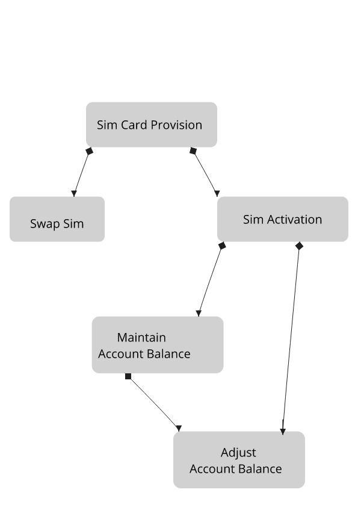

# Mpesa Engineer Hackathon -- Quesition 2
> SFC Ltd is a leading provider of Telco solutions. It has been contracted by a new MNO to provide a
Billing system to manage its fast growing subscribers.
## Getting Started
If you want to run the project locally on your machine.

### Prerequisites

You need to have at least python3.7 already installed or go to [python](https://python.org) and install.


### Installing

Follow the following instructions to install.
#### Create and activate a virtual Environment 

```
python -m venv  venv 
source venv/bin/activate
```
#### Run the project dependencies and Create databases
1. Create a database called ```mpesa```
2. Run project Dependencies
```
(venv)$: pip install -r requirements.txt
(venv)$: python run.py  
#Or
(venv)$: flask run
```

## Built With

* [python language](http://flask.pocoo.org/) - Flask Python Framework

## Authors

* **Omambia Dauglous** 
## Screenshots
### High Level Diagram 
 
## Previews 
* [API Publication ](https://web.postman.co/collections/7074539-b0e7f925-f4f1-4f35-8e85-967987b26934?version=latest&workspace=1f3376fb-9638-4485-870f-d120280c07c8)
## License

This project is licensed under the MIT License
## Acknowledgments

* My spirit towards code
* SafHackathon